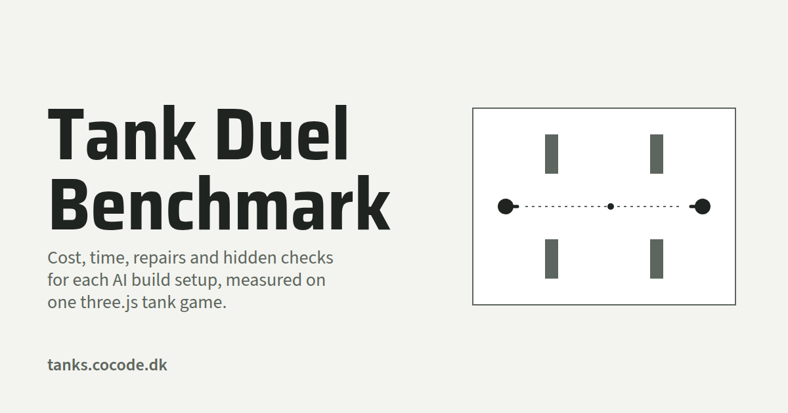

# Tank benchmark

Which build lifecycle should [graph-loop](https://github.com/cocodedk/graph-loop) use?
([issue #463](https://github.com/cocodedk/graph-loop/issues/463).) Each setup below builds its own copy of the
same game, **Tank Duel** (`spec.md`): a three.js arena where you and the computer drive tanks and shoot shells
that bounce once off the walls. Every version is kept in this project, under `runs/<setup>-<n>/`.

## Website

- [English](https://tanks.cocode.dk/)
- [فارسی (Persian)](https://tanks.cocode.dk/fa/)

## Features

- Seven build setups, A to G. Each builds the same game twice: 14 runs in all.
- Each run goes through build, test suite, an independent review and up to two repairs.
- 14 hidden checks grade each finished game through its WebMCP tools. The builder never sees them.
- Each run keeps its game, its logs, its numbers (`run.json`) and a screenshot.
- `bench.py watch` shows the runs live. `gallery.py` builds the results page from the finished ones.

### Setups

| | Builder | Workers | Repair |
|---|---|---|---|
| A | Sonnet 5.5 high (graph-loop today) | none | Sonnet 5.5 medium, same session |
| B | Opus 5.5 high, supervising | Sonnet 5.5 and Haiku 5.5, xhigh | Sonnet 5.5 medium, same session |
| C | Opus 5.5 high, supervising | Sonnet 5.5 and Haiku 5.5, xhigh | Opus 5.5 medium, same session |
| D | Sonnet 5.5 high | Haiku 5.5, xhigh | Sonnet 5.5 medium, same session |
| E | Opus 5.5 high, alone | none | Opus 5.5 medium, same session |
| F | as C | as C | a fresh Opus 5.5 medium session, from a brief |
| G | Opus 5.5 high, supervising | Haiku 5.5, xhigh | Opus 5.5 medium, same session |

Fixed for every run: the reviewer (gpt-6.1-sol medium, graph-loop's), a $10 Claude budget, up to two
repairs, and no repair starting after 75 minutes.

A run goes: build, suite (`bash test/gate.sh`), review, repair while red or refused. Then the hidden checks
(`hidden/checks.py`) grade the game through its WebMCP tools.

## Build from Source

Prerequisites:

- Python 3. The harness uses only the standard library.
- git
- [uv](https://docs.astral.sh/uv/), for `uvx`. It fetches Playwright when a suite or the hidden checks run.
- Google Chrome or Chromium, for the suite and the hidden checks. Set `CHROME` to its path if it is not on the `PATH`.
- The Claude Code CLI (`claude`), with access to the models in the table.
- The Codex CLI (`codex`), for the reviewer.

Clone and run:

    git clone https://github.com/cocodedk/tank-benchmark
    cd tank-benchmark
    python3 bench.py all 2       # all 7 setups, 2 repeats each, at once
    python3 bench.py all 2 B G   # only setups B and G, 2 repeats each
    python3 bench.py run B-1     # one run
    python3 bench.py status      # where each run is, and how it ended
    python3 bench.py watch       # the same, live (Ctrl-C leaves)
    python3 bench.py grade B-1   # the hidden checks again, on a finished run
    python3 gallery.py           # writes site/: the results page and each finished game

- Each run may spend up to $10 of Claude, so `all 2` may spend up to $140.
- `run` and `all` replace the run's folder in `runs/`. Copy a run somewhere first if you want to keep it.
- A build happens in `~/lean-tmp/tank-bench/work`, outside this project, so it never sees `hidden/` or another
  run. Set `BENCH_WORK` to use another folder.
- To play or test one game by hand: `cd runs/B-1/game && bash test/gate.sh`.

## Architecture

    bench.py            the harness: run, all, status, watch, brief, grade
    calls.py            the three calls a run makes: a Claude session, the suite, a Codex review
    progress.py         the status table and the live view
    gallery.py          builds site/, the results page
    page.html           the results page template; gallery.py fills in its data
    spec.md             the game's spec, "Tank Duel"
    seed/               the checkout every run starts from: CLAUDE.md, test/, vendor/ (three.js)
    hidden/checks.py    the 14 hidden checks; never copied into a run
    runs/<run>/         one folder per run: run.json, log/, game/, hidden.json, screenshot.png

`runs/<run>/run.json` holds the numbers (dollars per call and per model, minutes, cache-read share, rounds,
the suite and review per round, the hidden checks), `runs/<run>/game/` the game, `runs/<run>/log/` what each
call said, and `runs/<run>/screenshot.png` its first frame.

| Part | Made with |
|---|---|
| Harness | Python 3, standard library only |
| Builders and workers | Claude Code: Opus 5.5, Sonnet 5.5, Haiku 5.5 |
| Reviewer | Codex CLI: gpt-6.1-sol |
| Game | three.js r170 in `seed/vendor/`, plain ES modules, no build step |
| Game tools | WebMCP: `document.modelContext.registerTool` |
| Suite and hidden checks | Python `unittest` and Playwright, run through `uvx` |
| Results page | Static HTML, built by `gallery.py` |

## Limits

One new game in JavaScript is a different job from graph-loop's usual small edits to existing code, so a
winner here is one input to graph-loop's defaults, not the whole answer. Each setup has two builds, which is
a small sample. The grill stage (the spec review before the build) is left out: it does not vary between setups.

## Author

**Babak Bandpey** — [https://cocode.dk](https://cocode.dk) | [LinkedIn](https://linkedin.com/in/babakbandpey) | [GitHub](https://github.com/cocodedk)

## License

Apache-2.0 | © 2026 [Cocode](https://cocode.dk) | Created by [Babak Bandpey](https://linkedin.com/in/babakbandpey)

The full text is in [LICENSE](LICENSE).
